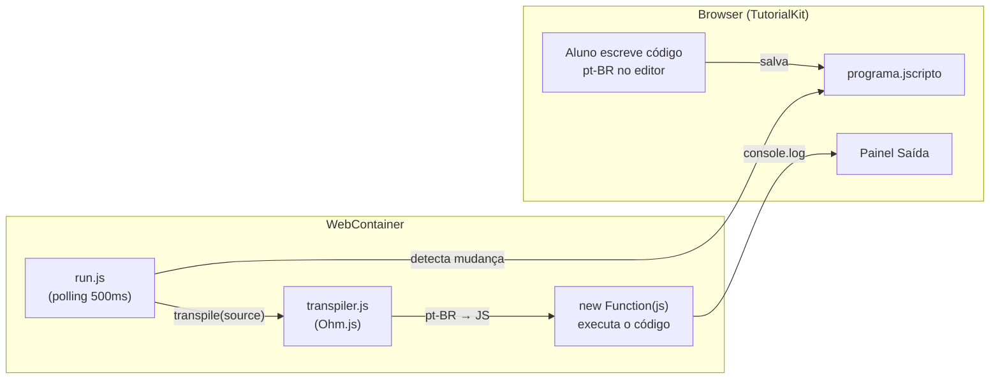

# JavaScripto

Plataforma de ensino de JavaScript para brasileiros.

O aluno aprende lógica de programação e JavaScript usando uma sintaxe em pt-BR. Palavras-chave como `se`, `senao`, `enquanto`, `funcao`, `retorne` são transpiladas para JavaScript válido antes de serem executadas.

## Por que JavaScripto?

A barreira do idioma é real. Quem está aprendendo a programar lida simultaneamente com:

- Lógica de programação (o conceito em si)
- Sintaxe da linguagem (regras, símbolos, estrutura)
- Vocabulário em inglês (`function`, `return`, `while`, `catch`...)

JavaScripto remove a terceira barreira. O aluno foca em **entender** o que está fazendo, não em memorizar palavras em outro idioma. Quando estiver confortável com os conceitos, a transição para JavaScript padrão é natural.

## Como funciona

O aluno escreve código em pt-BR:

```
funcao saudacao(nome) {
  se (nome) {
    retorne "Olá, " + nome + "!"
  } senao {
    retorne "Olá, mundo!"
  }
}

imprima(saudacao("Maria"))
```

O transpilador converte para JavaScript válido:

```js
function saudacao(nome) {
  if (nome) {
    return 'Olá, ' + nome + '!';
  } else {
    return 'Olá, mundo!';
  }
}

console.log(saudacao('Maria'));
```

### Fluxo da aplicação



**Passo a passo:**

1. O aluno edita `programa.jscripto` no editor CodeMirror integrado ao TutorialKit
2. `run.js` roda dentro do WebContainer e detecta mudanças via polling (a cada 500ms)
3. O código pt-BR é passado para `transpile()`, que usa a gramática Ohm.js para gerar JavaScript válido
4. O JavaScript gerado é executado via `new Function()`, e a saída (`console.log`) aparece no painel "Saída"

## Estrutura do projeto

```
javascripto/
├── packages/
│   └── transpiler/             # @javascripto/transpiler
│       ├── src/
│       │   ├── index.js        # API: transpile() + semânticas toJS()
│       │   └── javascripto.ohm # Gramática Ohm.js (fonte canônica)
│       └── tests/
│           ├── transpile.test.js  # Testes unitários (30 casos)
│           └── template.test.js   # Testes de integração
├── tutorial/                   # App Astro + TutorialKit
│   ├── src/
│   │   ├── templates/default/  # Template do runner (WebContainer)
│   │   │   ├── run.js          # Polling + execução
│   │   │   ├── transpiler.js   # Cópia standalone do transpilador
│   │   │   └── javascripto.ohm # Cópia da gramática
│   │   └── content/tutorial/   # Conteúdo das lições
│   │       └── 1-fundamentos/
│   │           ├── 1-primeiros-passos/  # Olá Mundo, Variáveis, Tipos
│   │           └── 2-logica/            # Condições, Laços, Funções
│   └── javascripto.tmLanguage.json  # Syntax highlighting
├── ideia/
│   └── decisoes.md             # Registro de decisões técnicas
└── package.json                # Scripts: dev, build, test, deploy
```

> O transpilador existe em duas cópias: a canônica em `packages/transpiler/` (usada para testes) e uma standalone em `tutorial/src/templates/default/` (que roda no WebContainer). Os testes de integração garantem que ambas ficam sincronizadas.

## Mapeamento pt-BR → JavaScript

| pt-BR | JavaScript | Categoria |
|---|---|---|
| `deixe` | `let` | Declaração |
| `fixe` | `const` | Declaração |
| `funcao` | `function` | Declaração |
| `retorne` | `return` | Controle |
| `se` | `if` | Condicional |
| `senao` | `else` | Condicional |
| `enquanto` | `while` | Laço |
| `para` | `for` | Laço |
| `verdadeiro` | `true` | Literal |
| `falso` | `false` | Literal |
| `nulo` | `null` | Literal |
| `imprima` | `console.log` | Saída |

> Keywords não usam acentos nem cedilha (`funcao` em vez de `função`) para facilitar a digitação.

## Stack

- **[TutorialKit](https://tutorialkit.dev/)** — plataforma de tutoriais interativos (Astro + WebContainer)
- **[Ohm.js](https://ohmjs.org/)** — gramática formal para o transpilador pt-BR → JS
- **CodeMirror 6** — editor com syntax highlighting para a sintaxe pt-BR

## Rodando localmente

```bash
# Instalar dependências
pnpm install

# Rodar o tutorial em modo dev
pnpm dev

# Rodar os testes do transpilador
pnpm test
```

## Contribuindo

O projeto está em fase inicial. Veja `ideia/decisoes.md` para entender as decisões técnicas tomadas até agora.

## Licença

A definir.
